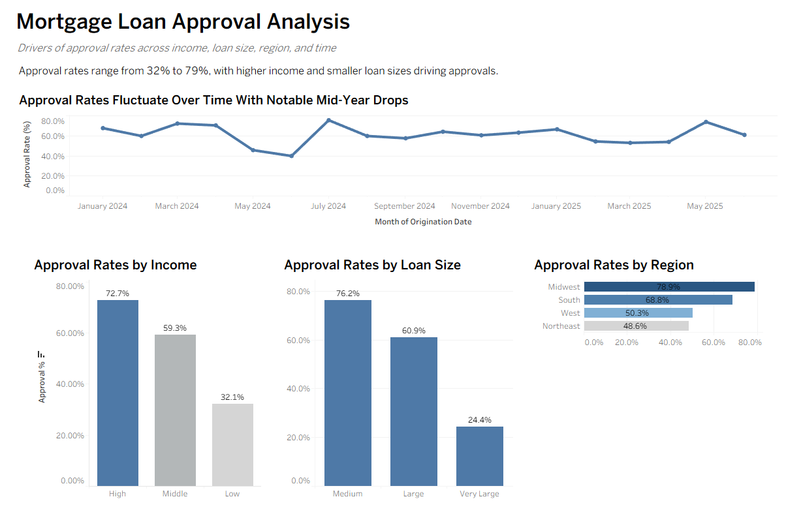

# Mortgage Loan Approval Analysis

End-to-end data analytics project using SQL (MySQL), Python (Pandas), and Tableau to analyze mortgage loan approval patterns.



*Dashboard showing approval trends by income, loan size, region, and time.*

---

## 📊 Project Overview

This project analyzes mortgage loan application data to identify patterns in approval outcomes across borrower characteristics, loan size, geography, and time.

The analysis focuses on how approval rates vary across borrower characteristics, loan size, geography, and time using SQL and Python for data preparation and Tableau for visualization.

---

## 🎯 Business Question

Which borrower and loan characteristics are associated with higher or lower mortgage approval rates?

---

## 🔍 Analysis Focus

- Income level  
- Loan size  
- Geographic region  
- Monthly trends over time  

---

## 🔧 Tools Used

- SQL (MySQL) – data cleaning, transformation, and analysis  
- Python (Pandas) – data preparation and feature engineering  
- Tableau – dashboard design and visualization  

---

## 📈 Key Findings

- Higher income borrowers show significantly higher approval rates (~72.7% vs ~32.1%)  
- Smaller and medium loan sizes are associated with higher approval likelihood  
- Approval rates vary by region, with Midwest and South outperforming coastal regions  
- Monthly trends reveal mid-year dips followed by recovery  

---

## 📊 Tableau Dashboard

👉 [View Interactive Dashboard](https://public.tableau.com/app/profile/trent.edwards/viz/MortgageLoanApprovalAnalysis_17756756057450/Dashboard1?publish=yes)

The dashboard includes:

- Approval Rate Over Time (monthly trend analysis)  
- Approval Rate by Income Level  
- Approval Rate by Loan Size  
- Approval Rate by Region  

---

## 🧠 Data Preparation

Data was cleaned and transformed using SQL and Python:

- Handled missing and inconsistent values  
- Created approval flag (approved vs denied)  
- Grouped income into categories (Low, Middle, High)  
- Bucketed loan amounts into size bands  
- Standardized categorical variables  

---

## 📁 Project Structure

```
mortgage-loan-approval-analysis/
├── data/
├── sql/
├── python/
├── images/
└── README.md
```

---
## 🎯 Conclusion

This project demonstrates how borrower income, loan size, and regional factors are associated with mortgage approval outcomes.

It highlights the importance of segmentation and structured analysis when evaluating financial data.

---

## 🔗 Links

- GitHub Repository: https://github.com/TrentEdwards2112/mortgage-loan-approval-analysis  
- Tableau Dashboard: https://public.tableau.com/app/profile/trent.edwards/viz/MortgageLoanApprovalAnalysis_17756756057450/Dashboard1?publish=yes  

---

## 💡 Notes

- This analysis identifies **associations, not causation**  
- Approval decisions depend on additional factors not included in the dataset  

